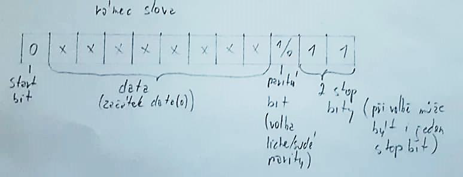
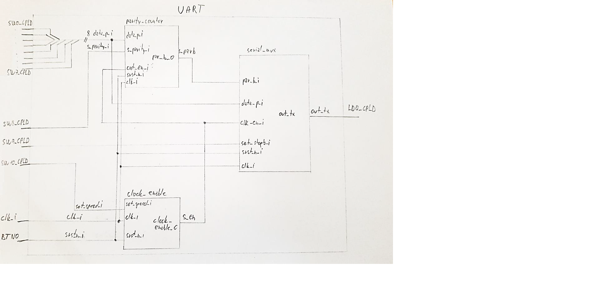
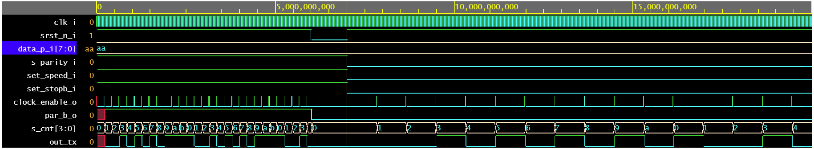

# **UART (Universal asynchronous receiver/transmitter)**

**Zadání:**\
Vysílač s nastavitelnými parametry UART rámce, datového slova a volby jedné ze dvou přednastavených standardních symbolových rychlostí za chodu aplikace.

Úkolem je vytvořit vysílač použitelný pro sériový asynchronní přenos dat. Transmitter vysílá datový rámec, jehož parametry jsou nastavitelné přepínači.
Bit 0 rámce se nazývá start-bit. Jeho hodnota je vždy L a slouží k signalizaci začátku (slova) rámce pro receiver. 
Následující bity 1 až 8 obsahují osm datových bitů, seřazených od b0 po b7. Vstupní data volíme přepínáním switchů (1 = H, 0 = L).
Bit 9 rámce je paritní bit, který mění svou hodnotu (H / L) tak aby byla dodržována zvolená parita. Sudou (L) nebo lichou (H) paritu měníme přepínačem.
Rámec zakončuje stop-bit. Stop-bit může být 1, nebo 2, v závislosti na nastavení H (2 stop-bity), nebo L (1 stop-bit).
Krom nastavení bitů v rámci můžeme měnit bitrate rámce. Běžný UART může používat celou řadu bitových rychlostí. V našem případě volíme mezi 1200 bps (L) a 4800 bps (H).

\
*fig. 1: znázornění podoby rámce UART*

| Označení pinu | Funkce |
| :-: | :-: |
| clk_i | hodinový signál 100 kHz|
| BTN0 | spínač pro synchronní reset zařízení |
| SW0_CPLD až SW7_CPLD | volba datového slova b0 - b7 |
| SW8_CPLD | volba parity: sudá/lichá |
| SW9_CPLD | nastavení počtu stop-bitů |
| SW10_CPLD | nastavení bitové rychlosti |
| LD0_CPLD  | výstup transmitteru |

*tabulka 1: přiřazení ovládacích, vstupních a výstupních pinů desek coolrunner a CPLD*

\
*fig. 2: blokové schéma synchronního systému UART*

\
*fig. 3: výsledek simulace souboru testbench.vhd v prostředí EDA playground*

**Závěr:**\
Systém je na základě simulace funkční a připravený k implementaci. 
Předpokládaný hodinový kmitočet je 100 kHz. Požadované bitraty 1200 a 4800 není možno metodou dělení kmitočtu nastavit úplně přesně. Liší se maximálně o 1 %, což v praxi, jelikož se přijímač synchronizuje  start-bitem s každým slovem.
Pro výstup jsme vybrali led LD0 na rozšiřující desce CPLD. Reálně se však bude zdát, že led neustále svítí, protože lidské oko nerozezná jednotlivé změny už okolo 50 Hz. 

**Zdroje:**\
 [1] Universal asynchronous receiver-transmitter [online] aktualizováno 22.3.2020. Dostupné z:
 https://en.wikipedia.org/wiki/Universal_asynchronous_receiver-transmitter
